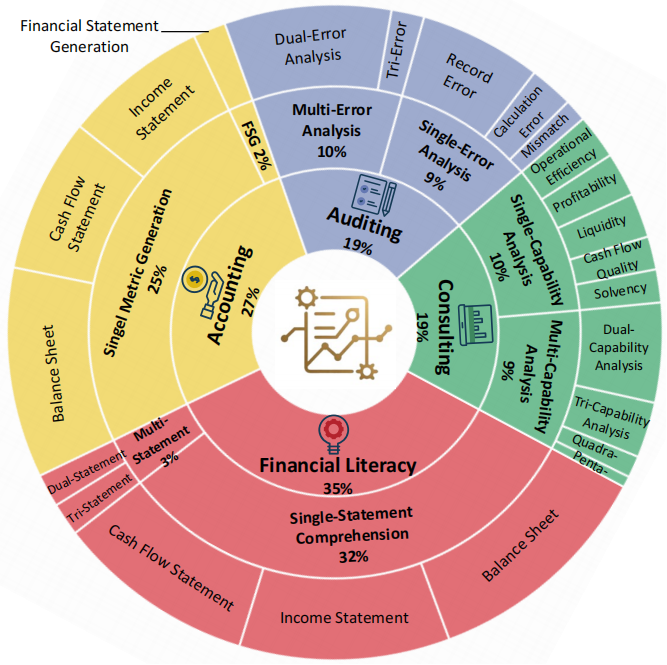
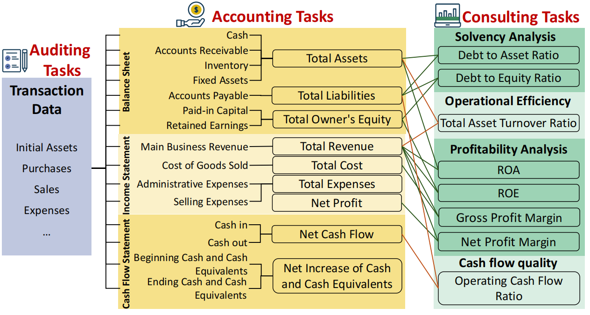
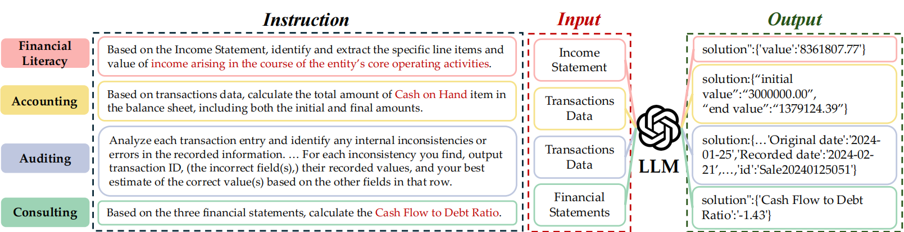

# FinMaster: A Holistic Benchmark for Mastering Full-Pipeline Financial Workflows with LLMs
<div align="center">

</div>

***
Existing benchmarks are limited by their reliance on static datasets, narrow task scope, and inability to capture the dynamic, multi-faceted nature of real-world financial workflows.
To address these issues, we present **FinMaster**, a holistic benchmark for mastering full-pipeline financial workflows with LLMs. 

Our work introduces three key components:

1. **FinSim**: a financial data simulator generating synthetic datasets that mirror real-world market dynamics;
2. **FinSuite**: a comprehensive task collection covering accounting, auditing, and consulting scenarios;
3. **FinEval**: a unified evaluation framework for systematic assessment of LLMs' financial capabilities.
   
To the best of our knowledge, **FinMaster** is the first benchmark that comprehensively covers full-pipeline financial workflows with challenging and realistic tasks.

The complete dataset is available on Kaggle:

[](https://www.kaggle.com/datasets/aixincui/finmaster-public-dataset)

You can access and download the FinMaster public dataset from our [Kaggle repository](https://www.kaggle.com/datasets/aixincui/finmaster-public-dataset). This dataset includes all the necessary data for reproducing our results.

## Tutorial

### Configure API Keys

Put your API keys into the folder `api_keys`
```python
finmaster/
├── api_keys/                
│   ├── openai_api_key.txt/
│   ├── huoshan_api_key.txt/             
│   ├── deepseek_api_key.txt/
|   ├── claude_api_key.txt/
│   └── maas_api_key.txt
```
### Generate Simulated data
To generate the simulated data, specify the ``<Company Name>`` ('config_chemistry', 'config_consulting', 'config_hotel', 'config_sales','config_big_manufactory') 
```python
python simulator/main.py config_chemistry
```
### Generate Simulated Tasks
To transform the simulated finance data into task suite
```python
python task_data_script/{data_accounting_read_statement.py, data_accounting_statement_generation.py, data_auditing.py, data_consulting.py}
```
### Systematic Assessment of LLMs
To test task suite with selected LLMs
```python
python finmaster/main_finmaster.py
```

### Dependencies
```
Python==3.9.18
litellm==1.67.2
openai==1.76.0 
tiktoken==0.7.0
tokenizers==0.10.3
huggingface-hub==0.30.2
aiohttp ==3.10.11
cupy  # Optional: Only if GPU support is needed
scipy>=1.10.0
matplotlib>=3.7.0
```


## 🔄 FinSim

FinSim is a financial simulator with three main stages:

1. **Data Generation**
   - Configures company-specific settings
   - Simulates business operations (assets, purchase, sales)
   - Produces comprehensive financial records

2. **Transaction Processing**
   - Generates realistic transactions
   - Incorporates deliberate errors for auditing scenarios

3. **Financial Reporting**
   - Income Statement: revenue and expense aggregation
   - Balance Sheet: assets, liabilities, and equity
   - Cash Flow Statement: operating, investing, and financing activities

### 📁 Project Structure

```python
simulator/
    ├── business_logic.py    # Core business operations and financial rules
    ├── data_generate.py     # Data generation and transaction simulation
    └── main.py             # Entry point and main program logic
```

  </p> <p align="center">  </p>
# 🎯 FinSuite

A financial task generation framework creating evaluation scenarios across accounting, auditing, and consulting domains.

## 🔨 Task Categories

### Financial Literacy Tasks
- Definition-matching queries on financial reports
- Progressive complexity levels for terminology, reasoning, and data processing

### Accounting Tasks
- **Tier 1**: Disclosure item generation (elementary & cross-transaction operations)
- **Tier 2**: Financial statement synthesis with standard compliance

### Auditing Tasks
- Invoice-format transaction data generation
- Systematic error embedding (12 types, 3 categories)
- Single & multi-error analysis levels

### Consulting Tasks
18 key indicators across profitability, operational efficiency, liquidity, solvency, and cash flow quality

### 📁 Project Structure
```python
task_data_script/
├── data_accounting_read_statement.py     # Statement reading and parsing
├── data_accounting_statement_generation.py    # Financial statement generation
├── data_auditing.py                     # Audit task simulation
└── data_consulting.py                   # Financial consulting scenarios
```

# 📋 FinEval Structure

## Overview
The prompt template provides a standardized framework for guiding LLMs in financial task solving, ensuring consistency across accounting, auditing, and consulting modules.

# ⚙️ Core Components

### Task Description
- Task identifier & objectives
- Module: Accounting/Auditing/Consulting

###  Examples
- Input: Sample data & parameters
- Output: Solution & demonstration
- Context: Explanation & reasoning

###  Problem Definition
- Task statement & requirements
- Input/Output specifications

###  Output Format
- JSON structure & validation
- Required fields & rules

###  Features
- Generic framework
- Module independent
- Standard format
- Clear validation


### 📁 Project Structure
```python
finmaster/
├── .idea/                     # IDE Configuration
│
├── api_keys/                  # API Keys Configuration
│   ├── claude_api_key
│   ├── deepseek_api_key
│   ├── huoshan_api_key
│   └── openai_api_key
│
├── finsuite/                  # Financial Suite Module
│   ├── __pycache__/
│   ├── __init__.py
│   ├── prompt.py             # Prompt Engineering
│   └── solver.py             # Problem Solver
│
├── run_task/                  # Task Runner Module
│
├── .DS_Store
└── main_finmaster.py         # Main Entry Point
```


