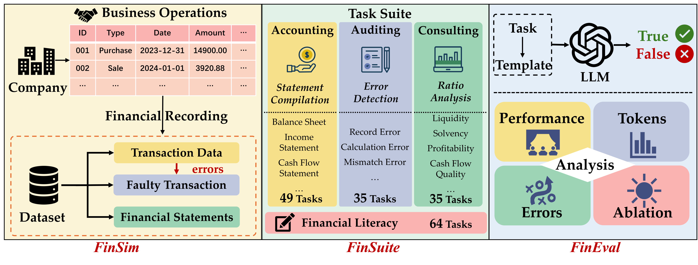

# FinMaster: A Holistic Benchmark for Mastering Full-Pipeline Financial Workflows with LLMs

***
Existing benchmarks are limited by their reliance on static datasets, narrow task scope, and inability to capture the dynamic, multi-faceted nature of real-world financial workflows.
To address these issues, we present **FinMaster**, a holistic benchmark for mastering full-pipeline financial workflows with LLMs. 

Our work introduces three key components:

1. **FinSim**: a financial data simulator generating synthetic datasets that mirror real-world market dynamics
2. **FinSuite**: a comprehensive task collection covering accounting, auditing, and consulting scenarios
3. **FinEval**: a unified evaluation framework for systematic assessment of LLMs' financial capabilities
   
